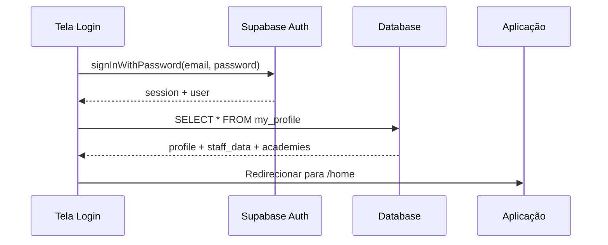
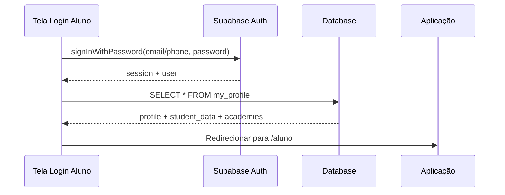
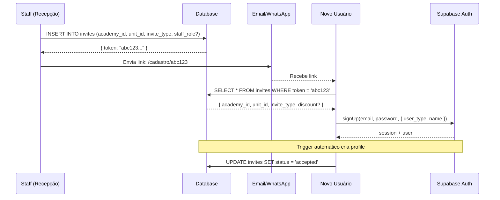

# 🔐 MoveAccess - Fluxo de Autenticação

> Documentação do fluxo de login e cadastro usando Supabase Auth

---

## Visão Geral

O MoveAccess usa **Supabase Auth** para autenticação, com extensão de dados em tabelas customizadas.

### Arquitetura

```
┌─────────────────────────────────────────────────────────────┐
│                      SUPABASE AUTH                          │
│  auth.users (gerenciado pelo Supabase)                      │
│  - id (UUID)                                                │
│  - email                                                    │
│  - phone                                                    │
│  - raw_user_meta_data (JSON com name, user_type)            │
└──────────────────────┬──────────────────────────────────────┘
                       │ 1:1 (trigger automático)
                       ▼
┌─────────────────────────────────────────────────────────────┐
│                     PUBLIC.PROFILES                         │
│  - id = auth.users.id                                       │
│  - user_type (staff | student)                              │
│  - name, email, phone, cpf, avatar_url                      │
└──────────────────────┬──────────────────────────────────────┘
                       │ 1:1 (condicional por user_type)
           ┌───────────┴───────────┐
           ▼                       ▼
┌──────────────────┐    ┌──────────────────┐
│  staff_profiles  │    │ student_profiles │
│  - role          │    │  - registration_id│
│  - status        │    │  - status         │
│  - permissions   │    │  - plan_*         │
│  - last_login_at │    │  - address        │
└──────────────────┘    └──────────────────┘
```

---

## Fluxos de Autenticação

### 1. Login Staff (Equipe)



**Campos retornados após login:**
```typescript
interface StaffSession {
  user: {
    id: string;
    email: string;
    user_type: 'staff';
    name: string;
    phone?: string;
    avatar_url?: string;
  };
  staff_data: {
    role: 'admin' | 'manager' | 'receptionist' | 'financial' | 'readonly';
    status: 'active' | 'inactive' | 'pending';
    permissions: string[];
    last_login_at?: string;
  };
  academies: Array<{
    academy_id: string;
    is_primary: boolean;
    academy: {
      id: string;
      trade_name: string;
      logo_url?: string;
    };
  }>;
}
```

---

### 2. Login Aluno (Student)



**Campos retornados após login:**
```typescript
interface StudentSession {
  user: {
    id: string;
    email: string;
    user_type: 'student';
    name: string;
    phone?: string;
    cpf?: string;
    avatar_url?: string;
  };
  student_data: {
    registration_id: string;  // ALU-2026-0001
    status: 'active' | 'inactive' | 'pending' | 'suspended' | 'blocked';
    plan_name?: string;
    plan_status?: 'active' | 'expired' | 'pending' | 'suspended' | 'cancelled';
    plan_expires_at?: string;
  };
  academies: Array<{
    academy_id: string;
    is_primary: boolean;
    academy: { id: string; trade_name: string; logo_url?: string };
  }>;
}
```

---

### 3. Cadastro via Convite (Link)

O cadastro de novos usuários é feito via link de convite gerado pelo staff.



**URL do convite:**
```
https://app.moveaccess.com/cadastro/{token}
```

**Estrutura do convite:**
```typescript
interface Invite {
  id: string;
  token: string;           // Token único (32 chars hex)
  academy_id: string;
  unit_id?: string;
  invite_type: 'staff' | 'student';
  staff_role?: 'admin' | 'manager' | 'receptionist' | 'financial' | 'readonly';
  status: 'pending' | 'accepted' | 'expired' | 'revoked';
  expires_at: string;      // Default: 7 dias
  discount?: {
    type: 'percentage' | 'fixed';
    value: number;
    appliesTo: 'first_month' | 'enrollment' | 'all';
  };
}
```

---

## Trigger Automático: Criação de Profile

Quando um usuário é criado em `auth.users`, um trigger automático cria o registro em `profiles`:

```sql
CREATE OR REPLACE FUNCTION handle_new_user()
RETURNS TRIGGER AS $$
BEGIN
  INSERT INTO public.profiles (id, user_type, name, email, phone)
  VALUES (
    NEW.id,
    COALESCE((NEW.raw_user_meta_data->>'user_type')::user_type, 'student'),
    COALESCE(NEW.raw_user_meta_data->>'name', split_part(NEW.email, '@', 1)),
    NEW.email,
    NEW.phone
  );
  RETURN NEW;
END;
$$ LANGUAGE plpgsql SECURITY DEFINER;
```

**Importante:** O `user_type` e `name` devem ser passados no `signUp`:

```typescript
const { data, error } = await supabase.auth.signUp({
  email: 'usuario@email.com',
  password: 'senha123',
  options: {
    data: {
      user_type: 'student',  // ou 'staff'
      name: 'Nome Completo'
    }
  }
});
```

---

## Variáveis de Ambiente

```env
# DEV
NEXT_PUBLIC_SUPABASE_URL=https://hvgqdihblfepstcxrcwb.supabase.co
NEXT_PUBLIC_SUPABASE_ANON_KEY=<sua-anon-key>

# PROD
NEXT_PUBLIC_SUPABASE_URL=https://ooinkljdxgixwflsasgr.supabase.co
NEXT_PUBLIC_SUPABASE_ANON_KEY=<sua-anon-key>
```

⚠️ **Nunca commite chaves sensíveis!** Use `.env.local` e adicione ao `.gitignore`.

---

## Implementação no Código

### Cliente Supabase

```typescript
// src/lib/supabase/client.ts
import { createBrowserClient } from '@supabase/ssr';

export function createClient() {
  return createBrowserClient(
    process.env.NEXT_PUBLIC_SUPABASE_URL!,
    process.env.NEXT_PUBLIC_SUPABASE_ANON_KEY!
  );
}
```

### Hook de Autenticação

```typescript
// src/hooks/useAuth.ts
import { useEffect, useState } from 'react';
import { createClient } from '@/lib/supabase/client';
import type { User } from '@supabase/supabase-js';

export function useAuth() {
  const [user, setUser] = useState<User | null>(null);
  const [loading, setLoading] = useState(true);
  
  useEffect(() => {
    const supabase = createClient();
    
    supabase.auth.getSession().then(({ data: { session } }) => {
      setUser(session?.user ?? null);
      setLoading(false);
    });
    
    const { data: { subscription } } = supabase.auth.onAuthStateChange(
      (_event, session) => {
        setUser(session?.user ?? null);
      }
    );
    
    return () => subscription.unsubscribe();
  }, []);
  
  return { user, loading };
}
```

### Obter Perfil Completo

```typescript
// src/lib/supabase/profile.ts
import { createClient } from './client';

export async function getMyProfile() {
  const supabase = createClient();
  
  const { data, error } = await supabase
    .from('my_profile')
    .select('*')
    .single();
    
  if (error) throw error;
  return data;
}
```

---

## Segurança

### Rate Limiting

O Supabase Auth já implementa rate limiting por padrão. Configurações adicionais podem ser feitas no dashboard.

### Verificação de Email

Por padrão, o email não requer confirmação. Para habilitar:

1. Acesse Dashboard > Authentication > Providers
2. Habilite "Confirm email"

### Bloqueio de Conta

O campo `status` em `staff_profiles` e `student_profiles` controla se o usuário pode acessar o sistema:

- `active` → Acesso permitido
- `pending` → Aguardando aprovação
- `inactive` → Conta desativada
- `suspended` → Conta suspensa temporariamente
- `blocked` → Conta bloqueada

A verificação é feita na aplicação após o login.

---

## Logout

```typescript
async function logout() {
  const supabase = createClient();
  await supabase.auth.signOut();
  // Redirecionar para login
}
```

---

## Próximos Passos

- [ ] Implementar recuperação de senha
- [ ] Adicionar login com telefone (OTP)
- [ ] Implementar 2FA para staff
- [ ] Adicionar refresh token rotation
